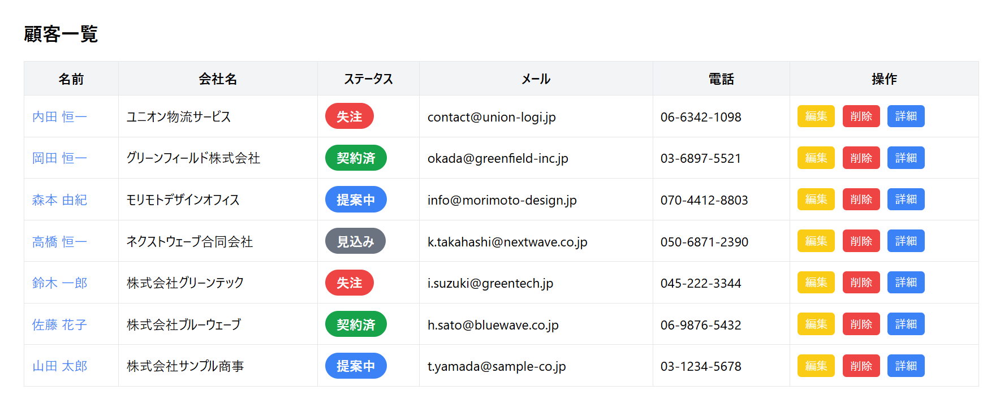
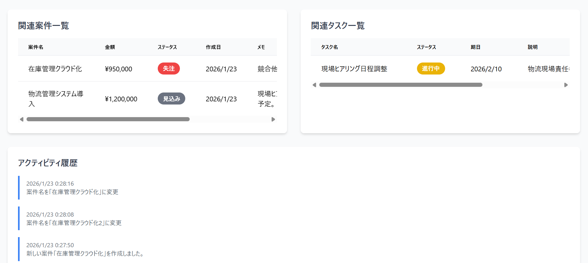
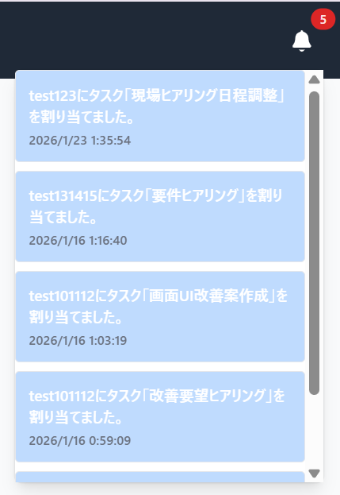

# 📊 CRM App – 顧客管理アプリ（MERN Stack）

## 🔗 デプロイURL
https://mern-crm-app-frontend-gf1j.onrender.com
※スマートフォン・PCの両方に対応しています。

## 🔑 テストログイン
※ デモ用アカウントのため、データは予告なく変更・削除される場合があります。

Email:test123@gmail.com　
Password:test123

## 📸 スクリーンショット

### 顧客一覧ページ
顧客の一覧表示・検索・ステータス確認が可能です。  

### 顧客詳細ページ
顧客情報に紐づく案件・タスク・活動履歴をまとめて確認できます。  

### 通知ドロップダウン
未読通知をリアルタイムで確認できます。  

## 📝 アプリ概要
このアプリは、顧客・案件・タスク・活動履歴・通知を一元管理できるCRM（顧客管理）Webアプリです。  
日々の営業活動や顧客対応の可視化・効率化を目的としています。

## 🔧 使用技術
- **フロントエンド**：React, Vite, Tailwind CSS, React Router  
- **状態管理 / 認証**：Context API, Firebase（認証・通知）, JWT  
- **UI / ライブラリ**：FontAwesome, Chart.js, react-toastify, @hello-pangea/dnd  
- **バックエンド**：Node.js, Express, MongoDB（別リポジトリ）  
- **ホスティング**：Vercel, Render  

## ✨ 主な機能
- 🔐 JWTベースのログイン / ログアウト（管理者・一般ユーザー権限）  
- 👥 顧客一覧・検索・詳細ページで案件や履歴を統合表示  
- 📊 Kanbanボードによる案件 / タスク進捗管理  
- 🔔 Navbarから未読通知をリアルタイム確認  
- 📈 売上・進捗をチャートで可視化するダッシュボード  

## 💡 工夫した点
- Context APIで認証・通知などの状態を一元管理  
- Chart.jsを活用したデータ可視化設計  
- Tailwindによる統一感のあるレスポンシブUI  
- ESLint + Prettierでのコードスタイル統一  

## 👤 作者情報
- 名前：t-nakanishi-dev
- GitHub：https://github.com/t-nakanishi-dev
